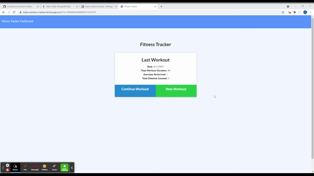

[](https://opensource.org/licenses/MIT)

# Workout Tracker

## Description

This application allows a user to create a new workout or add exercises to an existing workout. The user can view the total duration and total weight of multiple exercises from their past seven workouts on the "stats" page. This project provided the opportunity to create an application using a Mongo database with Mongoose schema. Express.js is used to handle routing.

## Table of Contents

- [Installation](#installation)
- [Usage](#usage)
- [Contributing](#Contributing)
- [Questions](#Questions)
- [License](#License)

## Installation

Clone repo and install dependencies:
```
git clone https://github.com/comatosino/e-commerce-back-end.git
npm i
```
Populate database with seed data (if needed):
```
npm run seed
```
To run:
```
npm start
```
OR with Nodemon:
```
npm run watch
```

## Usage

Click the gif below to check out the application!

[](https://bobs-workout-tracker.herokuapp.com/)

## Contributing

Contact me at one of the links below if you'd like to contribute!

## Questions

Questions? Reach out to me:

GitHub: [comatosino](https://github.com/comatosino)

Email: adamsiii.robert@gmail.com

## License
    
This project is covered under the [MIT](https://opensource.org/licenses/MIT) license.
    

